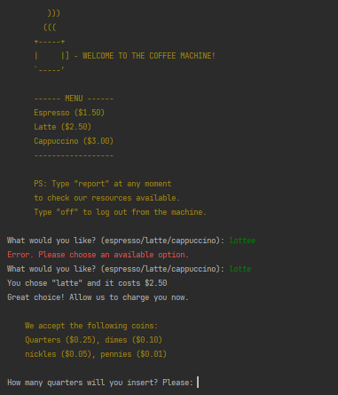

# The Coffee Machine Project | Python Bootcamp
This is a **very simple version** of a coffee machine, requested in *Dr. Angela Yu's Python Bootcamp*, from the London App Brewery. It's the version I came up with.

You may want to check the Object-Oriented-Programming version of this project here: [oop-coffee-machine-project](https://github.com/barbaracalderon/oop-coffee-machine-project) 

If you are studying programming paradigms, here's a suggestion: compare both projects (OOP and non-OOP).

### Project Requirements
Here's what this project requires:
- [x] Prompt user by asking "what would you like? (espresso/latte/cappuccino): "
- [x] Turn off the Coffee Machine by entering "off" to the prompt.
- [x] Print report.
- [x] Check if resources are sufficient.
- [x] Process coins.
- [x] Check if transaction is successful.
- [x] Make coffee.